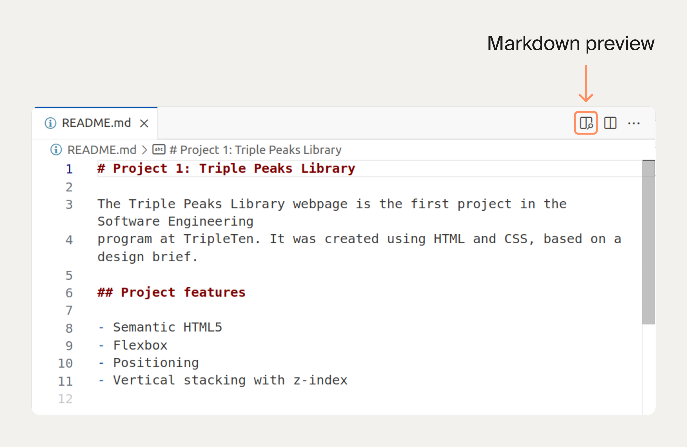

# Top-level heading (i.e., H1)

One H1 should be included at the top of the document.

## Second level heading (i.e., H2)

H2s are titles for your main subsections.
Add more `#`s to make smaller heading levels.

Italics: _asterisks_ or _underscores_.

Bold: **asterisks** or double **underscores**.

Combined italics and bold: **asterisks and** _underscores_\*\*.

Cross out text: ~~Don't need this.~~
Ordered list

1. The first point of a numbered list.
2. The second point.

Unordered list

- The first point of an unordered list
- The second point of an unordered list

The text of the link goes in square brackets, the URL goes in parentheses.

For example, here is a link to [MDN](https://developer.mozilla.org/en-US/).

Inline code is wrapped in backticks, like
this `console.log("Hello, world!");`

Code blocks are wrapped (or "fenced") in three backticks.
By default, there's no syntax highlighting.

```
touch README.md
```

## Deployed Site

Check out [this site](https://salehalfaqeer.github.io/ai-se_project_flashcards/) on GitHub Pages.



## Changes from Sprint #03

### The home view

- Making the header bar looks more responsive in the mobile.
- Creating mobile-bar.css file, to implement the small screen codes inside it.
- Changing the "New Desck" position to be at the bottom of the page in small screen view (and style it).
- Making the "linear-gradient" style to the footer.

### The deck view

- same changes in the "home view" page + styling and repositioning the practice button.

### The carousel view

- change the position of the buttons in mobile view to be in one row.
- Change the card width to be full screen.

and we added some shadow to the cards and buttons.

## Project Pitch Video

Check out [this video](https://drive.google.com/file/d/1gnVl-43xHpvDjk3OBgo_LpPLVGszHz_G/view?usp=sharing), where I describe my
project and some challenges I faced while building it.
